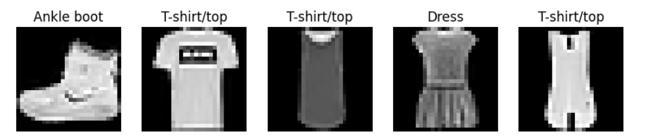
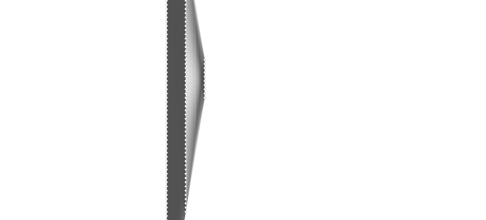
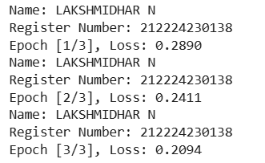
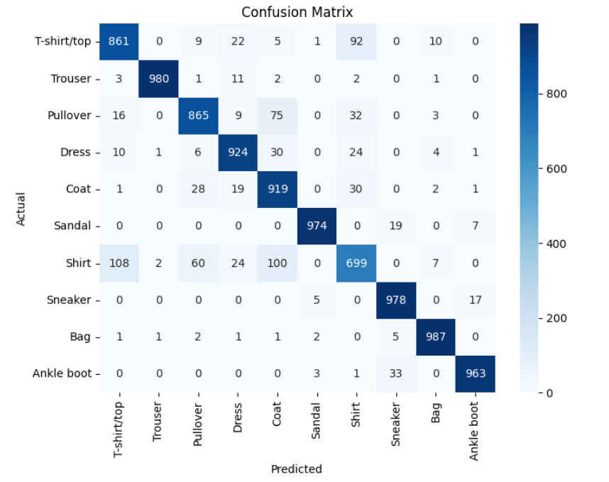
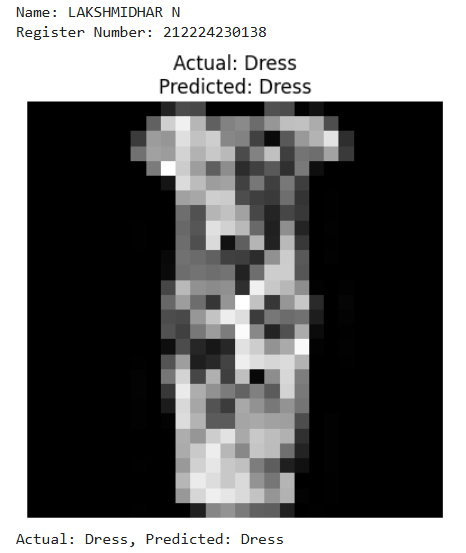

# Develop a Convolutional Deep Neural Network for Image Classification

## AIM
To develop a convolutional deep neural network (CNN) for image classification and to verify the response for new images.

##   PROBLEM STATEMENT AND DATASET

#### Problem Statement 
The problem is to design and develop a Convolutional Deep Neural Network (CNN) that can automatically classify grayscale images into predefined categories. The model must learn important spatial features such as edges, textures, and shapes from image data and accurately predict the correct class label.

#### Dataset

Sample images:



## Neural Network Model



## DESIGN STEPS
### STEP 1: 

oad the Fashion-MNIST dataset and apply tensor conversion and normalization. Create DataLoaders for training and testing with batch size 32.

### STEP 2: 

Build a CNN with three convolution layers, max-pooling, and three fully connected layers. Use ReLU activation and output 10 classes.

### STEP 3: 

Define CrossEntropyLoss as the loss function. Use Adam optimizer with learning rate 0.001.

### STEP 4: 

Perform forward pass, compute loss, backpropagate, and update weights. Repeat for specified epochs and print training loss.


### STEP 5: 

Switch to evaluation mode and calculate test accuracy. Generate confusion matrix and classification report.


### STEP 6: 

Select a test image and perform forward pass. Display actual and predicted class labels with the image.


## PROGRAM

### Name: LAKSHMIDHAR N

### Register Number: 212224230138

```python
class CNNClassifier(nn.Module):
    def __init__(self):
      super(CNNClassifier, self).__init__()
      self.conv1 = nn.Conv2d(in_channels = 1, out_channels=32,kernel_size=3,padding=1)
      self.conv2 = nn.Conv2d(in_channels = 32, out_channels=64,kernel_size=3,padding=1)
      self.conv3 = nn.Conv2d(in_channels = 64, out_channels=128,kernel_size=3,padding=1)
      self.pool = nn.MaxPool2d(kernel_size = 2, stride = 2)
      self.fc1 = nn.Linear(128*3*3, 128)
      self.fc2 = nn.Linear(128, 64)
      self.fc3 = nn.Linear(64, 10)
      
    def forward(self, x):
      x = self.pool(torch.relu(self.conv1(x)))
      x = self.pool(torch.relu(self.conv2(x)))
      x = self.pool(torch.relu(self.conv3(x)))
      x = x.view(x.size(0),-1)
      x = torch.relu(self.fc1(x))
      x = torch.relu(self.fc2(x))
      x = self.fc3(x)
      return x
        

from torchsummary import summary

# Initialize model
model = CNNClassifier()

# Move model to GPU if available
if torch.cuda.is_available():
    device = torch.device("cuda")
    model.to(device)

# Print model summary
print('Name: LAKSHMIDHAR N')
print('Register Number: 212224230138')
summary(model, input_size=(1, 28, 28))

# Initialize model, loss function, and optimizer
model =CNNClassifier()
criterion = nn.CrossEntropyLoss()
optimizer = optim.Adam(model.parameters(), lr=0.001)

# Train the Model
## Step 3: Train the Model
def train_model(model, train_loader, num_epochs=3):
    
  for epoch in range(num_epochs):
    model.train()
    running_loss = 0.0
    for images,labels in train_loader:
      optimizer.zero_grad()
      outputs = model(images)
      loss = criterion(outputs,labels)
      loss.backward()
      optimizer.step()
      running_loss += loss.item()
    print('Name: LAKSHMIDHAR N')
    print('Register Number: 212224230138')
    print(f'Epoch [{epoch+1}/{num_epochs}], Loss: {running_loss/len(train_loader):.4f}')


```

### OUTPUT

## Training Loss per Epoch



## Confusion Matrix



## Classification Report
```
Classification Report:
              precision    recall  f1-score   support

 T-shirt/top       0.86      0.86      0.86      1000
     Trouser       1.00      0.98      0.99      1000
    Pullover       0.89      0.86      0.88      1000
       Dress       0.91      0.92      0.92      1000
        Coat       0.81      0.92      0.86      1000
      Sandal       0.99      0.97      0.98      1000
       Shirt       0.79      0.70      0.74      1000
     Sneaker       0.94      0.98      0.96      1000
         Bag       0.97      0.99      0.98      1000
  Ankle boot       0.97      0.96      0.97      1000

    accuracy                           0.92     10000
   macro avg       0.91      0.91      0.91     10000
weighted avg       0.91      0.92      0.91     10000

```

### New Sample Data Prediction



## RESULT
Thus, the CNN model successfully classifies 28×28 Fashion-MNIST images into 10 categories with good accuracy and performance evaluation metrics.
